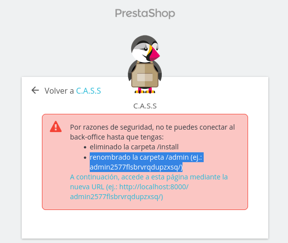

# Tarea 6 . Prestashop

### 1. Creamos del archivo docker-compose.yml(en el archivo te explico que hace cada elemento)

### 2. Levantamos el docker-compose con el siguiente comando: 

```bash
docker-compose up -d
```
### 3. Configuración de Prestashop:

Seleccionamos el idioma a nuestra elección y marcamos siguiente


Aceptamos las licencias, personalizamos nuestra cuenta y marcamos siguiente hasta llegar a la configuración de la conexión a la base de datos, en donde deberemos rellenar unos campos, con las variables de entorno del contenedor prestashop creadas en el archivo docker-compose.yml


Comprobamos que nos conecta correctamente a la base de datos y ya podríamos trabajar con prestashop.


* Si quieres entrar como administrador debes hacer unas modificaciones, y es que al querer entrar como administrador te saldrá este mensaje:



1. Para eliminar la carpeta install, tendremos que entrar al contendor prestashop y una vez dentro borrarla.

```bash
docker exec -it 9dd2639b57a0  sh #Entrar en el contenedor
```

```bash
rm -rf /Install # Borrar carpeta
```

2. Para el siguiente paso, deberemos renombrar la carpeta admin con un nombre aleatorio por ejemplo admin123edwd34

```bash
mv admin admin123xyz456 # Renombramos la carpeta
```

Una vez hecho esos cambios, iniciamos sesión  y ya podríamos entrar como administradores


Una vez finalizado, si queremos para el docker-compose escribimos:

```bash
docker-compose stop
```


